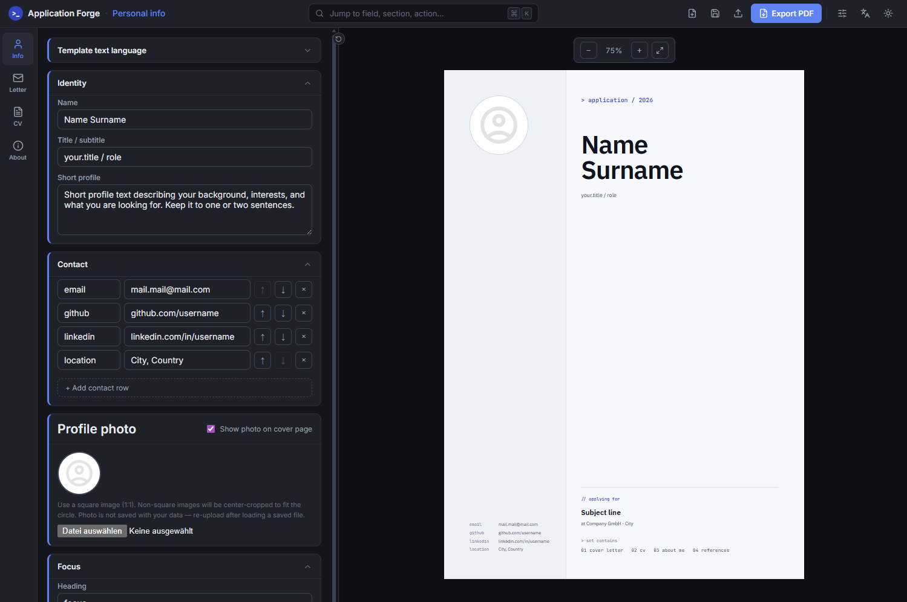

# Application Forge

A browser-only tool for writing job applications. Fill in your details once, pick an accent color, and export a cover page, cover letter, CV, and about-me page as a single PDF. All formatting is handled for you.

Successor to [cv-builder](https://github.com/paulriisk/cv-builder) prototype, extended from a single CV to a full four-document application set with a **shared design system and reworked UI.**



## Features

- **Four documents, one design system.**
- **Organize Multiple cover letters**
- **Live A4 preview**
- **Dev / Classic as preset style modes.**
- **Theme presets and Custom Color**
- **PDF export, single file or all together**
- **Auto-save to localStorage and manual saving**
- **Data saved in your memory only, no online saves**
- **Language Support for EN / DE**

## Planned

- Command palette (⌘K) for jumping to fields and triggering actions
- Standalone desktop build via Electron (portable .exe, no install required)
- Cover letter templates as starting points
- References tab
- Keyboard shortcuts and undo/redo

## Restrictions

The document layout and structure are intentionally fixed. Application Forge handles all formatting, the two style modes (Dev and Classic) are the only layout variants and there are currently no plans to make the document structure configurable.

## Tech stack

React 19, TypeScript (strict), Vite 8. Plain CSS with CSS variables, no Tailwind or CSS-in-JS. `useReducer` with split state/dispatch contexts. `html2canvas` + `jsPDF` for export. All fonts self-hosted via `@fontsource` packages (IBM Plex Sans, JetBrains Mono, Open Sans).

## Running locally

```bash
npm install
npm run dev        # dev server at http://localhost:5173/
npm run build      # type-check + production build into dist/
npm run preview    # serve the production build locally
```

## License

MIT — see `LICENSE`.
